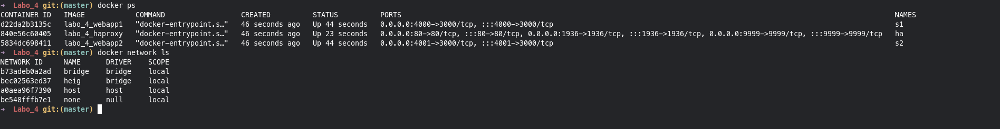
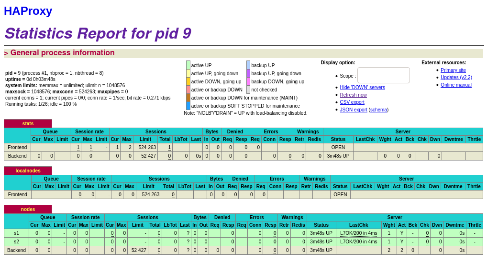
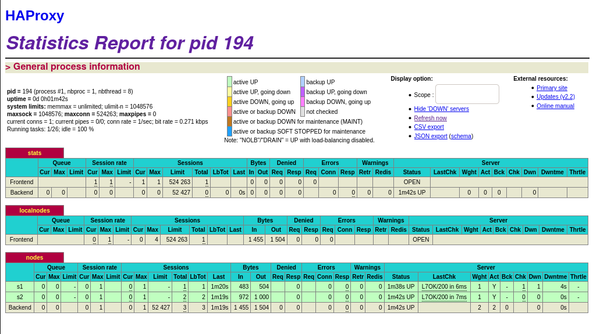

# Laboratoire 4 - Docker

> Auteurs: Gwendoline Dössegger, Noémie Plancherel, Gaby Roch
>
> Date: 12 janvier 2021
>
> Dépôt Git: https://github.com/g-roch/heig-ait-lab04

[TOC]

## 1. Introduction

## 2. Tâches

### Tâche 0

> [M1] Do you think we can use the current solution for a production environment? What are the main problems when deploying it in a production environment?

Non, notre environnement n'est pas scalable. Nous ne pouvons pas ajouter dynamiquement de nouveaux noeuds à notre infrastructure. On est obligés d'avoir des employés supplémentaires afin de déployer l'application car on ne peut pas le faire automatiquement.

> [M2] Describe what you need to do to add new `webapp` container to the infrastructure. Give the exact steps of what you have to do without modifiying the way the things are done. Hint: You probably have to modify some configuration and script files in a Docker image.

Nous devons en premier lieu configurer HAProxy à l'aide de son fichier de configuration pour ajouter le nouveau noeud. 

En second lieu, on doit modifier le fichier `docker-compose.yml` pour builder une webapp supplémentaire et la lier au HAProxy. 

Finalement, on doit rebuiler et relancer tous les conteneurs avec la commande:

```sh
docker-compose build
```

Puis la commande suivante pour exécuter les conteneurs en arrière-plan:

```sh
docker-compose up -d
```

> [M3] Based on your previous answers, you have detected some issues in the current solution. Now propose a better approach at a high level.

On pourrait proposer une détection de la charge sur HAProxy qui lancerait une commande pour déployer des noeuds supplémentaires. 

-> avoir une commande pour avoir des noeuds supplémentaires, modifier la config HAProxy et relancer les noeuds supplémentaires

> [M4] You probably noticed that the list of web application nodes is hardcoded in the load balancer configuration. How can we manage the web app nodes in a more dynamic fashion?

On pourrait modifier la config de HAProxy afin qu'elle détecte automatiquement la présence de nouveaux noeuds.

> [M5] Do you think our current solution is able to run additional management processes beside the main web server / load balancer process in a container? If no, what is missing / required to reach the goal? If yes, how to proceed to run for example a log forwarding process?

-> service spécifique sur chaque conteneur, peut pas démarrer plusieurs services par conteneur car on veut un endroit central pour les logs

-> si on veut plusieurs services sur le même conteneur, nous devons lancer notre propre application qui elle lancera à la fois le service web/load balancer et notre service de logs centralisé

-> comment le faire ? quels outils ? --> _docker système pour collecter logs des conteneurs qui tournent (compatibilité entre les conteneurs ?)_

> [M6] What happens if we add more web server nodt pas démarrer plusieurs services par conteneures? Do you think it is really dynamic? It's far away from being a dynamic configuration. Can you propose a solution to solve this?

-> ajouter plus de noeuds serveurs nous devons tjrs modifier la config HAProxy --> pas dynamique

-> nous devons etre capable de boucler dans la liste de noeuds et modifier la config pour chaque noeud

-> ceci peut etre archiver avec un moteur de modèle



> Take a screenshot of the stats page of HAProxy at <http://192.168.42.42:1936>. You should see your backend nodes.



> Give the URL of your repository URL in the lab report.

[Repo laboratoire](https://github.com/g-roch/heig-ait-lab04)

### Tâche 1

> Take a screenshot of the stats page of HAProxy at <http://192.168.42.42:1936>. You should see your backend nodes. It should be really similar to the screenshot of the previous task.



> Describe your difficulties for this task and your understanding of what is happening during this task. Explain in your own words why are we installing a process supervisor. Do not hesitate to do more research and to find more articles on that topic to illustrate the problem.

### Tâche 2

> Provide the docker log output for each of the containers: `ha`, `s1` and `s2`. You need to create a folder `logs` in your repository to store the files separately from the lab report. For each lab task create a folder and name it using the task number. No need to create a folder when there are no logs.

> Give the answer to the question about the existing problem with the current solution.

> Give an explanation on how `Serf` is working. Read the official website to get more details about the `GOSSIP` protocol used in `Serf`. Try to find other solutions that can be used to solve similar situations where we need some auto-discovery mechanism.

### Tâche 3

> Provide the docker log output for each of the containers:  `ha`, `s1` and `s2`. Put your logs in the `logs` directory you created in the previous task.

> Provide the logs from the `ha` container gathered directly from the `/var/log/serf.log` file present in the container. Put the logs in the `logs` directory in your repo.

### Tâche 4

> You probably noticed when we added `xz-utils`, we have to rebuild the whole image which took some time. What can we do to mitigate that? Take a look at the Docker documentation on [image layers](https://docs.docker.com/engine/userguide/storagedriver/imagesandcontainers/#images-and-layers).
> Tell us about the pros and cons to merge as much as possible of the
> command.

> Propose a different approach to architecture our images to be able to reuse as much as possible what we have done. Your proposition should also try to avoid as much as possible repetitions between your images.

> Provide the `/tmp/haproxy.cfg` file generated in the `ha` container after each step.  Place the output into the `logs` folder like you already did for the Docker logs in the previous tasks. Three files are expected.
>
> In addition, provide a log file containing the output of the `docker ps` console and another file (per container) with `docker inspect <container>`. Four files are expected.

> Based on the three output files you have collected, what can you say about the way we generate it? What is the problem if any?

### Tâche 5

> Provide the file `/usr/local/etc/haproxy/haproxy.cfg` generated in the `ha` container after each step. Three files are expected. 
>
> In addition, provide a log file containing the output of the `docker ps` console and another file (per container) with `docker inspect <container>`. Four files are expected.

> Provide the list of files from the `/nodes` folder inside the `ha` container. One file expected with the command output.

> Provide the configuration file after you stopped one container and the list of nodes present in the `/nodes` folder. One file expected with the command output. Two files are expected.
>
>  In addition, provide a log file containing the output of the  `docker ps` console. One file expected.

> (Optional:) Propose a different approach to manage the list of backend nodes. You do not need to implement it. You can also propose your own tools or the ones you discovered online. In that case, do not forget to cite your references.

### Tâche 6

> Take a screenshots of the HAProxy stat page showing more than 2 web applications running. Additional screenshots are welcome to see a sequence of experimentations like shutting down a node and starting more nodes.
>
> Also provide the output of `docker ps` in a log file. At least  one file is expected. You can provide one output per step of your experimentation according to your screenshots.

> Give your own feelings about the final solution. Propose improvements or ways to do the things differently. If any, provide references to your readings for the improvements.

> (Optional:) Present a live demo where you add and remove a backend container.

## 3. Difficultés

## 4. Conclusion