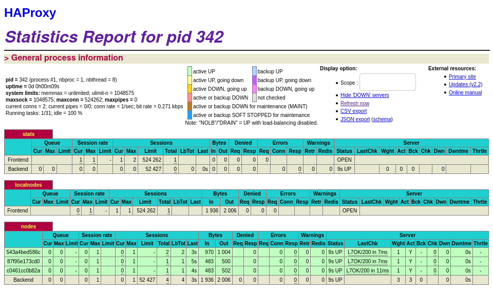
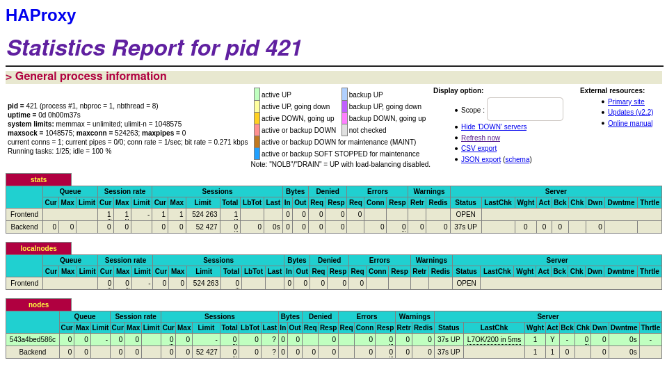
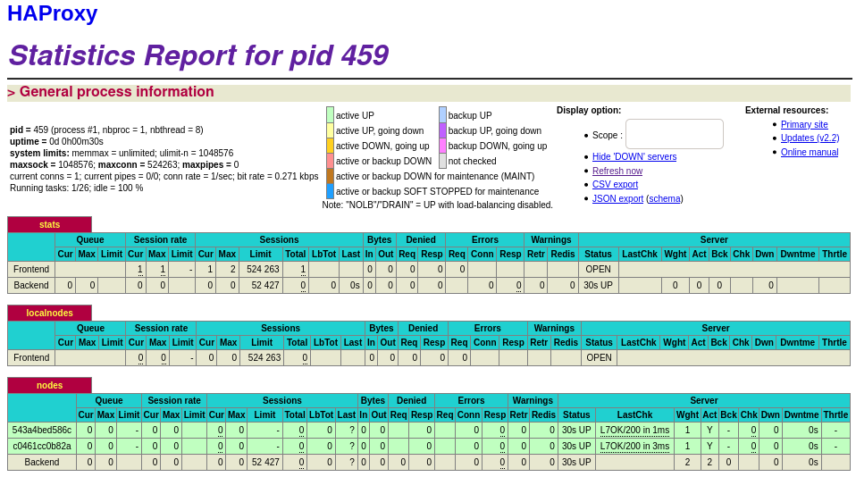

# Laboratoire 4 - Docker

> Auteurs: Gwendoline Dössegger, Noémie Plancherel, Gaby Roch
>
> Date: 12 janvier 2021
>
> Dépôt Git: https://github.com/g-roch/heig-ait-lab04

[TOC]

## 1. Introduction

Durant ce laboratoire, nous allons approfondir nos connaissances sur le load balancing, que nous avons déjà abordé au laboratoire précédent. Nous allons également utiliser Docker. 

## 2. Tâches

### Tâche 0

> [M1] Do you think we can use the current solution for a production environment? What are the main problems when deploying it in a production environment?

Non, notre environnement n'est pas scalable. Nous ne pouvons pas ajouter dynamiquement de nouveaux noeuds à notre infrastructure. On est obligés d'avoir des employés supplémentaires afin de déployer l'application car on ne peut pas le faire automatiquement.

> [M2] Describe what you need to do to add new `webapp` container to the infrastructure. Give the exact steps of what you have to do without modifiying the way the things are done. Hint: You probably have to modify some configuration and script files in a Docker image.

Nous devons en premier lieu configurer HAProxy à l'aide de son fichier de configuration pour ajouter le nouveau noeud. 

En second lieu, on doit modifier le fichier `docker-compose.yml` pour builder une webapp supplémentaire et la lier au HAProxy. 

Finalement, on doit rebuiler et relancer tous les conteneurs avec la commande:

```sh
docker-compose build
```

Puis la commande suivante pour exécuter les conteneurs en arrière-plan:

```sh
docker-compose up -d
```

> [M3] Based on your previous answers, you have detected some issues in the current solution. Now propose a better approach at a high level.

On pourrait proposer une détection de la charge sur HAProxy qui lancerait une commande pour déployer des noeuds supplémentaires de manière dynamique. 

> [M4] You probably noticed that the list of web application nodes is hardcoded in the load balancer configuration. How can we manage the web app nodes in a more dynamic fashion?

On pourrait modifier la configuration de HAProxy afin qu'elle détecte automatiquement la présence de nouveaux noeuds. Pour cela, il existe des outils de discovery qui permettent de modifier la configuration de HAProxy lorsqu'un nouveau membre rejoint ou quitte le pool.

> [M5] Do you think our current solution is able to run additional management processes beside the main web server / load balancer process in a container? If no, what is missing / required to reach the goal? If yes, how to proceed to run for example a log forwarding process?

Dans notre situation actuelle, nous avons un seul service spécifique sur chaque conteneur et il est donc impossible de démarrer plusieurs services par conteneur. 

`Docker` considaire le processus qu’il lance pour le conteneur comme étant le processus principal, lorsque ce processus se termine, le container est donc terminé pour lui. Si on souhaite pouvoir démarrer plusieurs services au sein du même conteneur, il serait nécessaire d’avoir un processus qui lancerait à la fois le service web/HAProxy et le service de logs centralisé.

Pour gérer un journal de log, `Docker` permet de récupérer les logs des conteneurs (accéssible via la commande `docker logs`, il n’y a donc pas forcement besoin d’un processus annexe.

> [M6] What happens if we add more web server nodes? Do you think it is really dynamic? It's far away from being a dynamic configuration. Can you propose a solution to solve this?

Afin d'ajouter de nouveaux noeuds serveurs, nous devons toujours modifier la configuration HAProxy et ainsi ce n'est pas une méthode très dynamique. Une solution possible serait de boucler dans la liste des noeuds et de modifier dynamiquement la configuration de HAProxy pour chaque noeud lors du démarrage de HAProxy. Ceci peut être archivé avec un template engine.

On peux également pousser le configuration automatique plus loin, en faisant en sorte que lorsqu’un nouveau nœud démarre et se signal auprès du conteneur `haproxy`, ce dernier se reconfigure automatiquement.

> Take a screenshot of the stats page of HAProxy at <http://192.168.42.42:1936>. You should see your backend nodes.


> Give the URL of your repository URL in the lab report.

[Dépôt du laboratoire: `https://github.com/g-roch/heig-ait-lab04`](https://github.com/g-roch/heig-ait-lab04)

### Tâche 1

> Take a screenshot of the stats page of HAProxy at <http://192.168.42.42:1936>. You should see your backend nodes. It should be really similar to the screenshot of the previous task.


> Describe your difficulties for this task and your understanding of what is happening during this task. Explain in your own words why are we installing a process supervisor. Do not hesitate to do more research and to find more articles on that topic to illustrate the problem.

Nous n'avons pas eu de difficultés particulières pour effectuer cette tâche; les consignes étaient claires et bien structurées. Nous étions déjà familiarisé avec les outils grâce au laboratoire précédent

Nous avons installé un process supervisor (comme indiqué dans la consigne) afin de répondre aux besoins de la question **[M5]**.

### Tâche 2

> Provide the docker log output for each of the containers: `ha`, `s1` and `s2`. You need to create a folder `logs` in your repository to store the files separately from the lab report. For each lab task create a folder and name it using the task number. No need to create a folder when there are no logs.

Voir les logs dans le répertoire `logs/task2`. Les fichiers présents sont:

- [`haproxy.log`](../logs/task2/haproxy.log)
- [`webapp1.log`](../logs/task2/webapp1.log)
- [`webapp2.log`](../logs/task2/webapp2.log)

> Give the answer to the question about the existing problem with the current solution.

Nous n'avons pas eu de problèmes particuliers lors de l'installation de `Serf` et comme nous pouvons le voir dans les logs, `Serf` fonctionne correctement. Cependant, notre système n'est pas encore dynamique car il n'est pas encore possible de gérer de nouveaux noeuds. Pour régler ce problème, il faudrait ajouter un script qui s'occupe de l'ajout d'un noeud dans le cluster.

> Give an explanation on how `Serf` is working. Read the official website to get more details about the `GOSSIP` protocol used in `Serf`. Try to find other solutions that can be used to solve similar situations where we need some auto-discovery mechanism.

`GOSSIP` est un protocole peer-to-peer qui est utilisé pour communiquer des informations au sein d'un cluster de noeuds. `Serf` l'utilise afin d'envoyer de messages en broadcast dans le cluster afin de maintenir à jour les noeuds actifs pour HAProxy.

Comme alternative, on pourrait utiliser l'outil `Consul` qui utilise également le protocole `GOSSIP` et qui fonctionne de la même manière que `Serf`, néanmoins il possède des fonctionnalités supplémentaires, telles que la découverte de service ou encore du health checking.

### Tâche 3

> Provide the docker log output for each of the containers:  `ha`, `s1` and `s2`. Put your logs in the `logs` directory you created in the previous task.

Voir les logs dans le répertoire `logs/task3`. Les fichiers présents sont:

- [`haproxy.log`](../logs/task3/haproxy.log)
- [`webapp1.log`](../logs/task3/webapp1.log)
- [`webapp2.log`](../logs/task3/webapp2.log)
- [`serf.log`](../logs/task3/serf.log)

> Provide the logs from the `ha` container gathered directly from the `/var/log/serf.log` file present in the container. Put the logs in the `logs` directory in your repo.

Voir le fichier [`serf.log`](../logs/task3/serf.log) dans le répertoire [`logs/task3`](../logs/task3).

### Tâche 4

> You probably noticed when we added `xz-utils`, we have to rebuild the whole image which took some time. What can we do to mitigate that? Take a look at the Docker documentation on [image layers](https://docs.docker.com/engine/userguide/storagedriver/imagesandcontainers/#images-and-layers).
> Tell us about the pros and cons to merge as much as possible of the command. In other words, compare:
>
> ```sh
> RUN command 1
> RUN command 2
> RUN command 3
> ```
>
> vs.
>
> ```sh
> RUN command 1 && command 2 && command 3
> ```

Les deux façons de faire on leur avantage.

- La premier avec une ligne par commande, et très utile lors du dévellopement, car une image est créée entre chaque commande. Si on ne modifie que la dernier commande seule cette dernière est réexecutée, ce qui permet de gagner du temps
- La seconde permet justement d’éviter de créer ces images temporaire et donc de limiter la taille totale à stocker pour le conteneur. Cette méthode est à privilégier lors qu’il y a des commande qui générer beaucoup de cache et qu’on veux executé un autre commande pour vider ce cache (notamment lorsqu’on n’a pas besoin de ce cache à l’execution)

> What about the merge of the commands ? What type of merge do you precognize ?

On conseille donc d’utiliser la méthode 1 lors du développement puis la méthode 2 lors de la publication.

TODO:

Like 1 line to pull all neded dependencies then 1 line to decompress them then 1 line to install them ? or 1 line per dependencies

> Propose a different approach to architecture our images to be able to reuse as much as possible what we have done. Your proposition should also try to avoid as much as possible repetitions between your images.

Nous pouvons utiliser `FROM` dans le Dockerfile avec une image de base qui contiendrait tout ce qu'il y a en commun entre HAProxy et Nodejs. Puis, ces deux derniers hériteront de l'image de base. Cela nous permettra d'avoir des images plus petites pour HAproxy et Nodejs.

> Provide the `/tmp/haproxy.cfg` file generated in the `ha` container after each step.  Place the output into the `logs` folder like you already did for the Docker logs in the previous tasks. Three files are expected.

Voir les fichiers de configuration dans le répertoire `logs/task4`. Les fichiers présents sont:

- `haproxy_ha.cfg`
- `haproxy_s1.cfg`
- `haproxy_s2.cfg`

> In addition, provide a log file containing the output of the `docker ps` console and another file (per container) with `docker inspect <container>`. Four files are expected.

Voir les fichiers de logs dans le répertoire `logs/task4`. Les fichiers présents sont:

-  `docker_ps.log`
- `docker_inspect_ha.log`
- `docker_inspect_s1.log`
- `docker_inspect_s2.log`

> Based on the three output files you have collected, what can you say about the way we generate it? What is the problem if any?

Nous constatons que `Handlebars` écrase les entrées dans le fichier `haproxy.cfg` avec `>` au lieu de les ajouter avec `>>`. Nous le voyons à la ligne 16 dans le script `member-join.sh`:

```sh
handlebars --name $HOSTNAME --ip $HOSTIP < /config/haproxy.cfg.hb > /tmp/haproxy.cfg
```

Le problème est qu'à chaque fois qu'un noeud se connecte au cluster, le log de connexion est écrasé au lieu d'être ajouté. Ceci pourrait poser problème car cela indique que le système n'est pas encore dynamique et qu'il faudrait lancer manuellement chaque noeud et s'assurer à chaque fois que noeud s'est correctement connecté. Nous remarquons qu'aucune trace n'est écrite lors des connexions des noeuds ce qui est pas une bonne pratique.

### Tâche 5

> Provide the file `/usr/local/etc/haproxy/haproxy.cfg` generated in the `ha` container after each step. Three files are expected. 

Voir les fichiers de configuration dans le répertoire `logs/task5`. Les fichiers présents sont:

- `haproxy_first_started.cfg`
- `haproxy_second_started.cfg`
- `haproxy_stopped.cfg`

> In addition, provide a log file containing the output of the `docker ps` console and another file (per container) with `docker inspect <container>`. Four files are expected.

Voir les fichiers de logs dans le répertoire `logs/task5`. Les fichiers présents sont:

- `docker_ps.log`
- `docker_inspect_ha.log`
- `docker_inspect_s1.log`
- `docker_inspect_s2.log`

> Provide the list of files from the `/nodes` folder inside the `ha` container. One file expected with the command output.

Voir le fichier `content_nodes1.log` dans le répertoire `logs/task5`.

Ci-dessous, après le démarrage des deux webapps, on voit les deux conteneurs. 

```sh
➜  Labo_4 git:(master) ✗ docker-compose exec haproxy ls /nodes
543a4bed586c  87f95e173cd0
```

> Provide the configuration file after you stopped one container and the list of nodes present in the `/nodes` folder. One file expected with the command output. Two files are expected.

Voir les fichiers  `haproxy_stopped.cfg` et `content_nodes2.log` dans le répertoire `logs/task5`.

Lors de l'arret de la webapp1:

```sh
➜  Labo_4 git:(master) ✗ docker stop s1
s1
➜  Labo_4 git:(master) ✗ docker-compose exec haproxy ls /nodes
543a4bed586c
```

> In addition, provide a log file containing the output of the  `docker ps` console. One file expected.

Voir le fichier  `docker_ps2.log`  dans le répertoire `log/task5`.

> (Optional:) Propose a different approach to manage the list of backend nodes. You do not need to implement it. You can also propose your own tools or the ones you discovered online. In that case, do not forget to cite your references.

Nous n'avons pas effectué cette manipulation.

### Tâche 6

23.12.21, arrivés jusqu'ici, nous avons fait les task 2-5:

- utilisation de Serf pour le gestion de membres
- configuration de handlebars/nodejs
- changement du haproxy de manière dynamique lorsqu'il y des changements de membres
- 

> Take a screenshots of the HAProxy stat page showing more than 2 web applications running. Additional screenshots are welcome to see a sequence of experimentations like shutting down a node and starting more nodes.
>
> Also provide the output of `docker ps` in a log file. At least one file is expected. You can provide one output per step of your experimentation according to your screenshots.

Pour la première partie, nous avons ajouté un nouveau noeud dans le cluster, `s3`. Voir le fichier `docker_ps.log` dans le répertoire `log/task6`. Nous avons également capturer les statistiques et nous pouvons voir la troisième webapp.



Pour la seconde partie, nous avons arrêté les noeuds s1 et s3. Voir le fichier `docker_ps_stopped.log`. Nous pouvons voir dans la capture de statistiques suivantes, qu'il ne reste plus qu'un noeud dans le cluster.



Finalement, nous avons redémarré s3. Voir le fichier `docker_ps_started_s3.log`. Nous pouvons voir dans la capture de statistiques suivantes, qu'il y a les noeuds s2 et s3 dans le cluster.



> Give your own feelings about the final solution. Propose improvements or ways to do the things differently. If any, provide references to your readings for the improvements.

HAProxy est assez réactif dans notre cas, car nous utilisons un petit nombre de noeuds et il y a peu de noeuds qui s'éteignent ou s'activent dans un temps donné. 

Dans le cas contraire, nous risquerions d'avoir des pertes de connexion lorsqu'un client demande une page web et que HAProxy est en train de redémarrer et se reconfigure.

Un autre point qui pourrait être amélioré est qu'il est nécessaire d'ajouter manuellement les noeuds dans le ficher de configuration docker-compose afin de les ajouter au cluster. Il est possible d'utiliser des `replicas` de docker-compose qui nous permettent de démarrer n conteneurs ayant la même configuration en même temps.

> (Optional:) Present a live demo where you add and remove a backend container.

Nous n'avons pas effectué cette manipulation.

## 3. Difficultés

Nous n'avons pas eu de difficultés particulières durant ce laboratoire. La consigne était très claire et chaque étape était bien expliquée et documentée.

## 4. Conclusion

En conlusion, ce laboratoire nous a permis de prendre en main HAProxy avec son système de configuration/reconfiguration. Nous avons abordé le protocole `GOSSIP` et l'outil `Serf`. De plus, nous avons vu `Handlebars`.

## 5. Références

https://docs.docker.com/compose/compose-file/compose-file-v3/#replicas

https://www.consul.io/docs/intro/vs/serf

https://www.serf.io/

https://www.serf.io/docs/internals/gossip.html